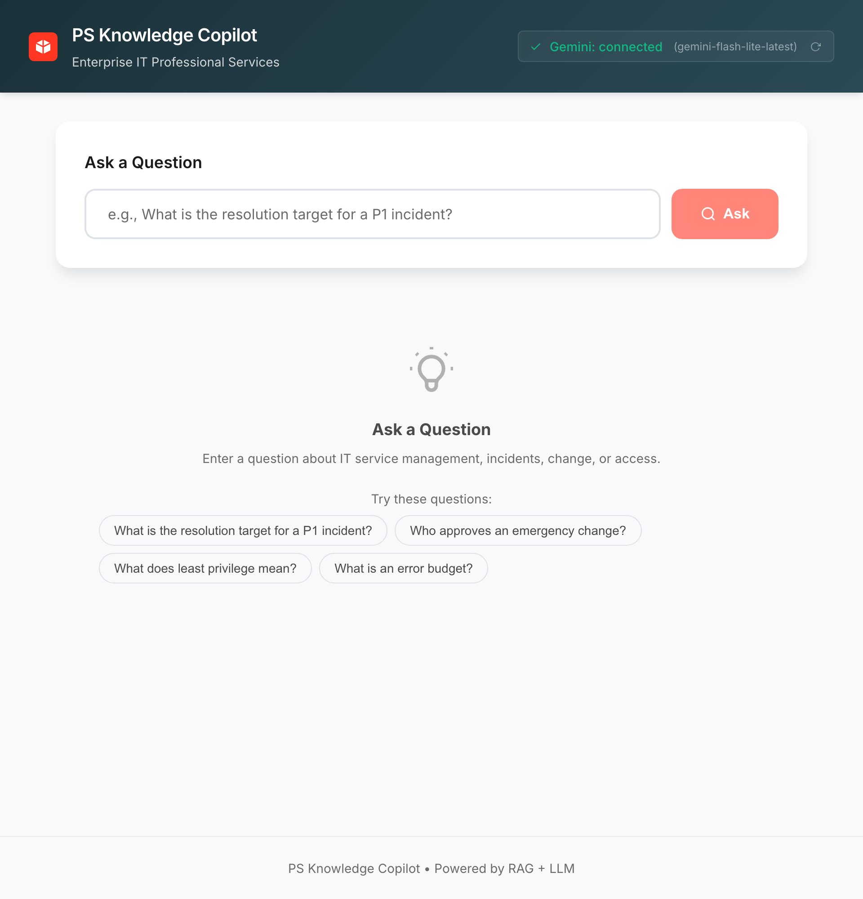
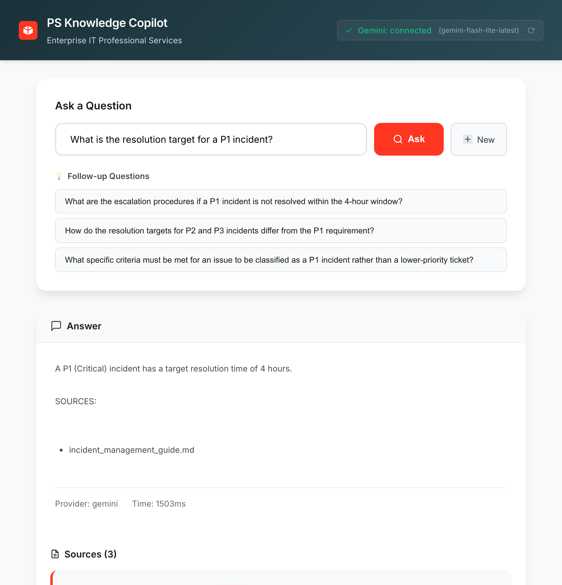
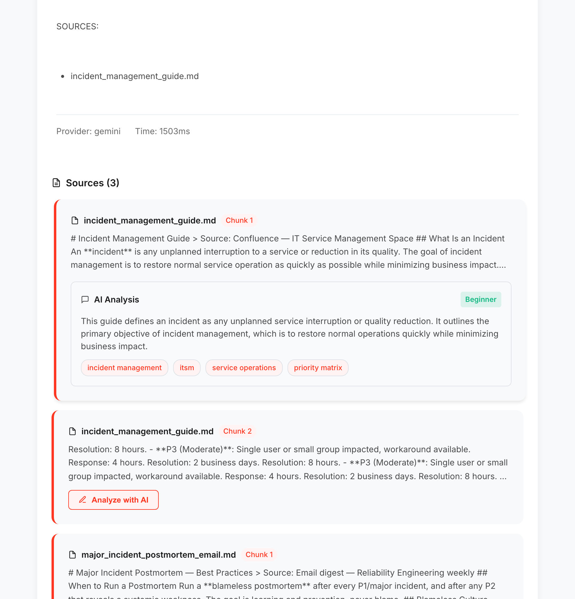
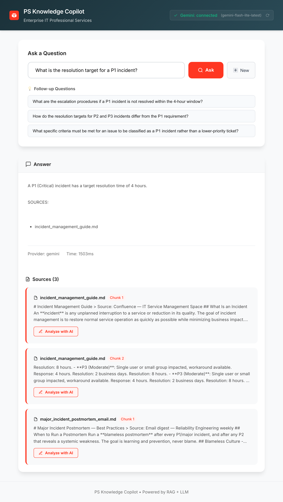

# 🌱 GreenScape Copilot

An internal AI "Knowledge Assistant" for the employees of GreenScape Lawn & Landscape, a small business offering sprinkler installs, lawn care (mowing, fertilization, seeding), and yard maintenance (tree & brush trimming). This tool ingests the company's service guides, policies, and FAQs and gives staff instant, accurate answers to customer questions using Retrieval-Augmented Generation (RAG).

## 📸 Screenshots

### Main Interface
The clean, modern interface features a consolidated AI connection status pill in the header showing the active LLM provider (Google Gemini), a search input, and quick-action example questions to get started instantly.



---

### Smart Query with RAG-Powered Answers
Ask any question and receive AI-generated answers grounded in your knowledge base. Answers are rendered with full markdown formatting, and the system retrieves the most relevant source chunks with relevance scores.



---

### AI Document Analysis
Click "Analyze with AI" on any retrieved source to get an instant summary, relevant topic tags, and a complexity rating (beginner/intermediate/advanced) — helping you quickly assess document relevance without reading the full text.



---

### Full Interface with Source Citations
The complete view shows AI-powered answers with intelligent source citations from the company knowledge base (service guides, field SOPs, the office handbook, and the customer-service FAQ), each linked to their original chunk and source file.



## 🚀 Features

### Core Functionality
-   **RAG Architecture**: Retrieves relevant context from ingested docs before answering.
-   **Local AI**: Uses a free, local Hugging Face model (`LaMini-Flan-T5`) for privacy and cost-efficiency.
-   **Vector Search**: Powered by ChromaDB with Sentence-Transformers embeddings.
-   **Modern React UI**: Clean, responsive interface with real-time status indicators and example queries.
-   **FastAPI Backend**: High-performance async API with automatic documentation.
-   **Source Citations**: Every answer includes references to the source documents with relevance scores.

### 🆕 New AI-Powered Features
-   **💬 Smart Follow-up Questions**: AI automatically generates 3 contextual follow-up questions after each query
-   **📝 AI Document Analysis**: Click "Analyze with AI" on any source to get:
    - Concise 2-3 sentence summaries
    - Relevant topic tags
    - Complexity rating (beginner/intermediate/advanced)
-   **🔌 AI Connection Status**: Real-time monitoring of LLM provider health with visual indicators
-   **🎯 Interactive Question Chips**: Click any follow-up question to instantly trigger a new query

### 🧪 Prompt Engineering Layer
The prompts are treated as versioned, testable artifacts rather than inline strings — the core of a disciplined prompt-engineering workflow:
-   **📚 Versioned Prompt Library** (`app/prompts/library.py`): Every prompt is a named, versioned `PromptTemplate` recording its **technique** (zero-shot, few-shot, chain-of-thought, structured output) and a written **rationale** for its design.
-   **🔬 A/B Evaluation Harness** (`app/eval/`): Runs each prompt variant against a golden dataset and scores it on citation accuracy, format adherence, grounding/faithfulness, keyword recall, and appropriate refusal — a data-driven loop for measuring prompt changes. Runs offline (free, deterministic) or against a live provider.
-   **🧱 Structured Outputs**: Capable models (Gemini/OpenAI/Anthropic) use a strict-JSON contract with native JSON mode; small local models fall back to delimiter parsing.
-   **🛡️ Safety Guardrails** (`app/prompts/guardrails.py`): Prompt-injection detection (blocks override/jailbreak attempts), PII redaction (emails, SSNs, API tokens), and untrusted-context fencing to defend against *indirect* injection via poisoned documents.

```bash
# Compare prompt variants offline (no API key needed):
python -m app.eval.runner

# Evaluate against a live provider:
python -m app.eval.runner --provider gemini --save results.json
```

### 🔒 Security & Best Practices
-   **Prompt-Injection Defense**: Adversarial inputs blocked before reaching the LLM; retrieved context fenced as untrusted data
-   **PII Redaction**: Emails, SSNs, credit cards, and API tokens scrubbed before any third-party API call
-   **Input Validation**: Max length limits (500 chars for queries, 5000 for analysis)
-   **Rate Limiting**: 20 requests/min for queries, 10/min for analysis to prevent abuse
-   **Security Headers**: X-Frame-Options, X-Content-Type-Options, XSS Protection
-   **Strict CORS**: Limited to specific origins, methods, and headers
-   **Dependency Pinning**: All package versions locked for reproducible builds

## 🛠️ Tech Stack

-   **Backend**: Python 3.11+ with FastAPI
-   **Frontend**: React 18 + Vite
-   **LLM**: Google Gemini (`gemini-3.5-flash`) by default; pluggable OpenAI, Anthropic, and local/API Hugging Face (`LaMini-Flan-T5-248M`) providers. Override the Gemini model with the `GEMINI_MODEL` env var.
-   **Prompt Engineering**: Versioned prompt library + offline A/B eval harness + injection/PII guardrails
-   **Vector Store**: ChromaDB
-   **Embeddings**: Sentence Transformers (`all-MiniLM-L6-v2`)

## 📦 Setup

1.  **Clone the repository**:
    ```bash
    git clone <repo-url>
    cd PS-Knowledge-Copilot
    ```

2.  **Create Virtual Environment & Install Backend Dependencies**:
    ```bash
    python3 -m venv venv
    source venv/bin/activate
    pip install -r requirements.txt
    ```

3.  **Configure Environment**:
    ```bash
    # Copy environment example
    cp .env.example .env

    # Add your Gemini key (default provider). Get one at:
    # https://aistudio.google.com/app/apikey
    # GEMINI_API_KEY=your_key_here
    #
    # Other providers are optional; the local Hugging Face model needs no key.
    # OPENAI_API_KEY / ANTHROPIC_API_KEY / HUGGINGFACE_API_KEY
    ```

4.  **Install Frontend Dependencies**:
    ```bash
    cd frontend
    npm install
    cd ..
    ```

5.  **Run everything with one command** (recommended):
    ```bash
    ./dev.sh
    ```
    This starts the backend (`:8000`, which auto-connects to Gemini on boot) **and**
    the frontend (`:5173`) together. Open `http://localhost:5173`. Press `Ctrl+C` to stop both.

    > ⚠️ Running only `npm run dev` starts the frontend alone — every query will show
    > "unknown error" because there is no backend to answer it. Use `./dev.sh` (or start
    > both servers manually below).

    <details>
    <summary>Or run the two servers manually</summary>

    **Backend** (Terminal 1):
    ```bash
    source venv/bin/activate
    uvicorn app.api.main:app --reload --port 8000
    ```
    API + docs at `http://localhost:8000/api/docs`.

    **Frontend** (Terminal 2):
    ```bash
    cd frontend
    npm run dev
    ```
    App at `http://localhost:5173`.
    </details>

## 👥 How the Team Uses This

This tool helps front-desk staff and crews answer customer questions consistently, without hunting down the owner or a veteran employee.

### 1. The Front Desk 🛠️
**Scenario**: A customer calls after a fertilization visit.
-   **Query**: *"How long until my lawn is safe for pets after a treatment?"*
-   **Result**: The Copilot answers "until it's fully dry, about 1–2 hours," citing `fertilization_weed_control.md`.
-   **Benefit**: A confident, correct answer on the spot — no guessing.

### 2. The Scheduler 🗓️
**Scenario**: Booking fall services.
-   **Query**: *"When is the best time to overseed a lawn?"*
-   **Result**: Recommends early fall, citing `seeding_aeration.md`.
-   **Benefit**: Sets the right expectation and books the service in the right season.

### 3. The Sales Rep 🌱
**Scenario**: A homeowner asks about sprinkler upkeep.
-   **Query**: *"Why do sprinkler systems need to be winterized?"*
-   **Result**: Explains that trapped water freezes and cracks pipes, citing `sprinkler_system_guide.md`.
-   **Benefit**: Turns a question into an upsell for a winterization visit.

## 🔄 Ingestion Workflow

To add new knowledge:
1.  Place `.md`, `.txt`, or `.ipynb` files in `data/example_inputs/`.
2.  Use the API endpoint to trigger ingestion:
    ```bash
    curl -X POST http://localhost:8000/api/ingest \
      -H "Content-Type: application/json" \
      -d '{"directory": "data/example_inputs"}'
    ```
3.  The system automatically chunks, embeds, and indexes the new content.

> **Tip**: Check `http://localhost:8000/api/stats` to see the current document count in the knowledge base.

## 🔐 Security

This project implements enterprise-grade security practices:

- **API Rate Limiting**: Prevents abuse with configurable limits per endpoint
- **Input Validation**: Automatic validation of all user inputs with Pydantic
- **Security Headers**: OWASP-recommended headers to prevent common web vulnerabilities
- **CORS Protection**: Strict cross-origin policies for production deployments
- **Environment Isolation**: Sensitive credentials via environment variables only

> ⚠️ **Important**: Never commit `.env` files. Always rotate API keys if accidentally exposed.

## 📚 API Endpoints

### Core Endpoints
- `POST /api/query` - Ask a question (rate limit: 20/min)
- `POST /api/analyze` - Analyze document text (rate limit: 10/min)  
- `GET /api/ai-status` - Check LLM connection status
- `POST /api/ingest` - Add documents to knowledge base
- `GET /api/health` - System health check
- `GET /api/stats` - Knowledge base statistics

Full API documentation available at `http://localhost:8000/api/docs`

## 🧪 Testing

Run the test suite:
```bash
source venv/bin/activate
python tests/test_llm_features.py
```

## 📝 License

Internal tool for GreenScape Lawn & Landscape employees.
